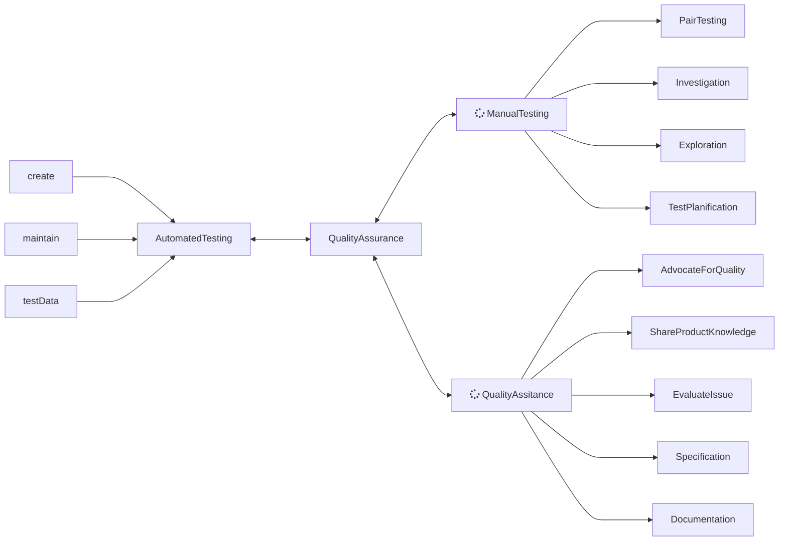

# Vision

## What is a QA Engineer ?

- He doesn't participate in code creation for the product, so he doesn't create quality.
- He found the truth about the current state of the product and give the alert to the team.
- He is not the last line of defense.
- Agility, pragmatism and team spirit

## What is quality ? 

- It's the confidence on a working product delivered in production. 

