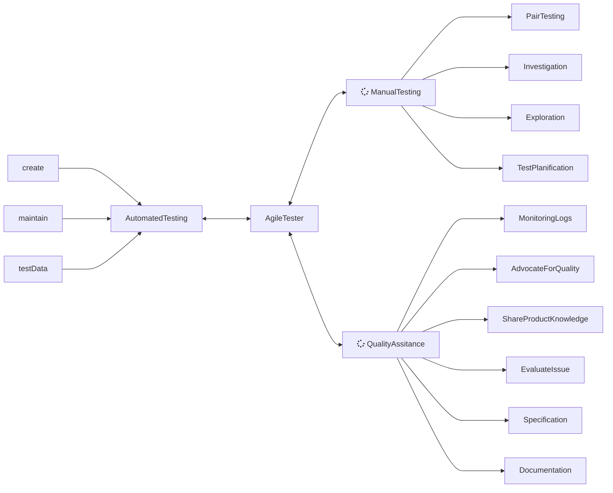

# Vision
---

## What is quality ? 

- It's the confidence on a working product delivered in production.
- Make sure the quality treshold correspond to the expectations of the company.

## What is a QA Engineer ?

- He doesn't participate in code creation for the product, so he doesn't create quality.
- He found the truth about the current state of the product and give the alert to the team.
- He is not the last line of defense.
- Common sense, Communication, Team spirit are needed for the job.

## Skills
The associated skills are:
- Manual testing, discovering and qualifying bugs
  - Execute test cases
  - Perform exploratory testing
  - Report testing results
- Discovering and qualifiying bug
  - Analyse issues when encountered
  - Report reproductible defects
  - Define the criticity of a defect
  - Confirm fixed defects
  - Record residual defects
- Creating test plans: 
  - Define a testing scope
- Define test cases
  - Prioritize test cases
  - Plan out testing phases
  - Prepare testing environments
  - Analyse potential risks
  - Create automation plan
- Automating tests and managing QA environments
  - Prepare test data
  - Code automated tests
  - Analyse test results
  - Maintain automated tests
- Knowledge management
  - Refine product specifications
  - Refine technical specifications
  - Gather product knowledge
  - Share information with relevant stakeholders
  - Advocate for user-centricity

